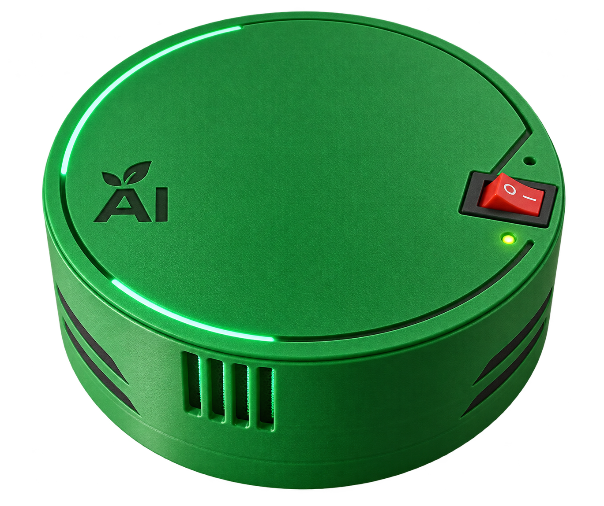

# Impulsar-01 — Local Home AI Station

[Русская версия](README-RU.md)

Open-source home AI station: a voice assistant and smart home control on a single-board computer.

## Features

- On-device Russian speech recognition in real time
- Voice control of Zigbee devices using a fixed command vocabulary
- LED status indication (listening, command, ready, error)
- Event log for monitoring and diagnostics

## Hardware

- Orange Pi CM4 (Rockchip RK3566) single-board computer
- Microphone expansion board
- USB Zigbee coordinator

## Documentation

Project documentation lives in [`docs/`](docs/):

- [Vision & Scope](docs/vision-ru.md) — product vision, MVP scope, success criteria
- [SRS](docs/srs-ru.md) — technical specification: requirements, use cases, acceptance tests
- [Backlog](docs/backlog-ru.md) — user stories with priorities and estimates
- [User story map](docs/user-story-map-ru.md) — scenarios and MVP slice
- [Hardware reference](docs/hardware-ru.md) — Orange Pi CM4 platform details
- [Glossary](docs/glossary-ru.md) — hardware terms
- [Diagrams](docs/diagrams/) — PlantUML sources (context, use cases, components)

## Contributing

Please read [CONTRIBUTING.md](CONTRIBUTING.md) before submitting changes.

## License

Licensed under [GPL-3.0](LICENSE).
