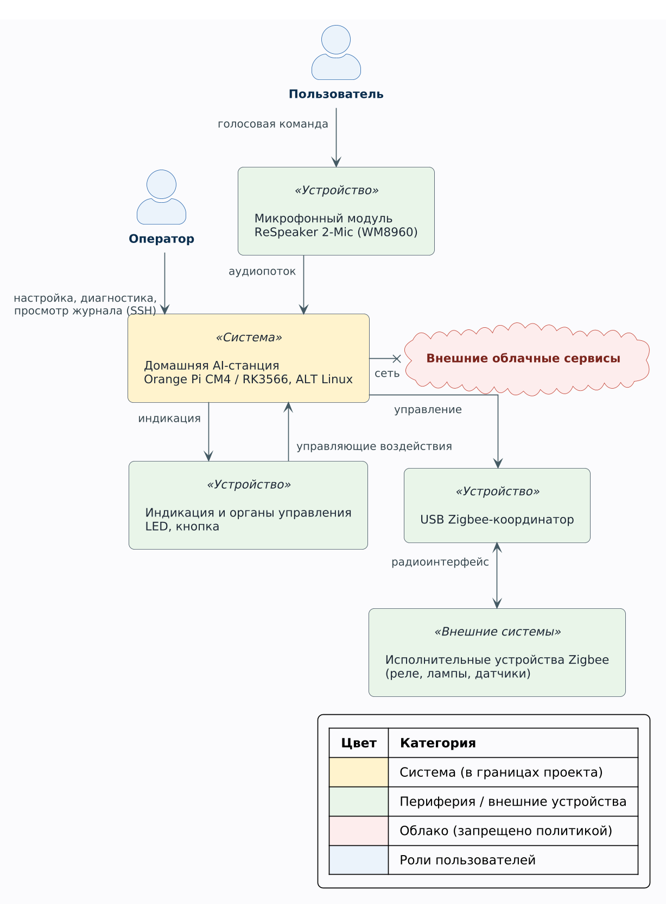
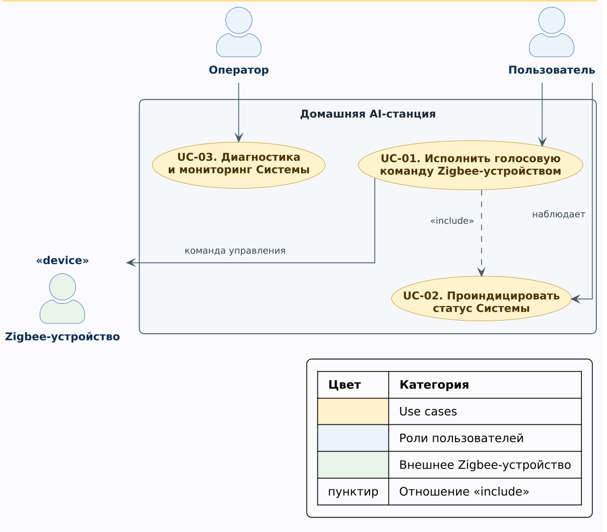

# Техническое задание на систему «Домашняя AI-станция» (SRS)

Версия документа: 0.1
Связанные документы:
[Видение и границы](./vision-ru.md), [Бэклог](./backlog-ru.md), [Карта пользовательских историй](./user-story-map-ru.md).

## 1. Общие сведения

### 1.1. Полное и краткое наименование системы

- Полное наименование: автоматизированная система локального распознавания речи и голосового управления устройствами с поддержкой протокола Zigbee «Домашняя AI-станция».
- Краткое наименование: Домашняя AI-станция (далее — Система, АС).

### 1.2. Заказчик и разработчик

- разработчик: <сообщество проекта>;
- модель разработки: OpenSource;

### 1.3. Перечень документов, на основании которых создаётся Система

- ГОСТ 34.602-90 «Информационная технология. Комплекс стандартов на автоматизированные системы. Техническое задание на создание автоматизированной системы»;
- [docs/vision-ru.md](./vision-ru.md) — видение и границы проекта;
- документация Orange Pi CM4 (Rockchip RK3566);

### 1.4. Термины и сокращения

- ASR (Automatic Speech Recognition) — распознавание речи;
- STT (Speech-to-Text) — перевод речи в текст;
- GigaAM — открытая русская ASR-модель;
- VAD (Voice Activity Detection) — детекция речевой активности;
- Zigbee — открытый протокол беспроводной сети устройств малого радиуса;
- HAT (Hardware Attached on Top) — плата расширения на 40-контактном разъёме;
- интент — распознанное намерение пользователя (действие + параметры);
- DTB (Device Tree Blob) — скомпилированное описание устройств платформы;
- ФТ — функциональное требование; НФ-требование — нефункциональное требование;
- UC (Use Case) — сценарий использования системы;
- логическая модель данных — представление сущностей данных и связей между ними без привязки к физической реализации хранения.

## 2. Назначение и цели создания Системы

### 2.1. Назначение Системы

Система предназначена для локального распознавания русской речи, голосового управления исполнительными устройствами Zigbee.

### 2.2. Ожидаемые цели создания

- Ц1. Обеспечить автономное распознавание речи на одноплатном компьютере Orange Pi CM4 (SoC RK3566) под управлением Embedded Linux.
- Ц2. Реализовать управление устройствами Zigbee голосовыми командами из фиксированного словаря.

## 3. Характеристика объекта автоматизации

### 3.1. Описание объекта автоматизации

Объект автоматизации — домашняя среда пользователя: короткие голосовые команды  и исполнительные устройства Zigbee (реле, лампы, датчики).

### 3.2. Контекстная диаграмма

Контекстная диаграмма: Система и внешние сущности с информационными потоками
между ними.

Исходный код диаграммы: [diag-context.uml](./diagrams/diag-context.uml).

### 3.3. Use case модель

Сценарии использования Системы.

Общая диаграмма сценариев — код PlantUML: [diag-usecase.uml](./diagrams/diag-usecase.uml).

#### UC-01. Исполнить голосовую команду Zigbee-устройством

| Поле | Содержание |
|---|---|
| Актор | Пользователь (основной); Zigbee-устройство (вторичный) |
| Триггер | пользователь произносит команду из словаря |
| Предусловие | Система запущена, сервисы активны; Zigbee-адаптер работоспособен; целевое устройство сопряжено; профиль усиления применён |
| Основной поток | 1. П1 захватывает аудиопоток. 2. П2 детектирует речевой сегмент. 3. Система переводит фазу в «распознаю»; П3 выдаёт транскрипт сегмента в реальном времени; выполняется UC-02. 4. П6 нормализует текст и вычисляет процент совпадения с интентом. 5. Процент ≥ порогу подтверждения: П6 инициирует событие управления; Система переводит фазу в «команда»; выполняется UC-02. 6. П7 исполняет действие на целевом устройстве. 7. Система фиксирует в журнале событие управления. 8. Постусловие достигнуто |
| Альтернативные потоки | 2a. Речевой сегмент не обнаружен — возврат к шагу 1. 4a. Процент совпадения ниже порога подтверждения — фраза игнорируется, событие управления не порождается. 6a. Устройство недоступно — Система переводит фазу в «ошибка», выполняется UC-02; в журнал фиксируется «ошибка» |
| Постусловие | При успехе: состояние Zigbee-устройства изменено; событие управления зафиксировано в журнале. При 6a: состояние Zigbee-устройства не изменено; ошибка зафиксирована в журнале |

#### UC-02. Проиндицировать статус Системы

| Поле | Содержание |
|---|---|
| Актор | Пользователь (вторичный) |
| Триггер | Смена фазы Системы на индицируемую: «распознаю», «команда», «ошибка». Фаза «слушаю» светодиодами не отображается |
| Предусловие | Система запущена; журнал доступен; задана таблица соответствия фазы и светодиода (см. п. 4.1, П4); все три светодиода работоспособны |
| Основной поток | 1. Система определяет текущую фазу 2. П4 включает светодиод, закреплённый за фазой, в заданном режиме. 3. Система фиксирует фазу в журнале |
| Альтернативные потоки |  |
| Постусловие | Текущая фаза отображена доступными средствами индикации; событие зафиксировано в журнале |

#### UC-03. Диагностика и мониторинг Системы

| Поле | Содержание |
|---|---|
| Актор | Оператор |
| Триггер | подозрение на сбой, плановая проверка |
| Предусловие | доступ по SSH; диагностические скрипты установлены; журнал systemd доступен; у Оператора есть права на чтение журнала |
| Основной поток | 1. Оператор запускает скрипт диагностики аппаратуры: аудио, DTB. 2. Система выдаёт состояние аппаратуры. 3. Оператор просматривает журнал systemd: события работы и событий управления |
| Альтернативные потоки | 3а. Журнал не сохранил запись событий |
| Постусловие | Состояние аппаратуры проверено; инциденты отражены в журнале;  |

## 4. Требования к Системе

### 4.1. Требования к структуре и функционированию

Система состоит из подсистем.

- П1. Подсистема захвата аудио: микрофонный модуль (HAT ReSpeaker 2-Mic), ALSA-карта; профили усиления «далеко» и «тихий голос».
- П2. Подсистема детекции и предобработки речи: Silero VAD; программная нормировка усиления перед инференсом.
- П3. Подсистема распознавания речи: GigaAM (ONNX, реалтайм); допустимая альтернатива — whisper.cpp для сравнительных замеров;
- П4. Подсистема индикации: LED на микрофонном модуле.
- 4.1 Соответствие фаз и светодиодов:
| Фаза | Светодиод | Режим |
|---|---|---|
| «слушаю» | — | все выключены |
| «распознаю» | LED-1 | постоянный |
| «команда» | LED-2 | 1с |
| «ошибка» | LED-3 | мигание |
- П5. Подсистема исполнения: запуск сервисов systemd, журнал событий, самовосстановление.
- П6. Подсистема интерпретации команд: сопоставляет распознанный текст с интентами фиксированного словаря; порождает событие управления; передаёт событие в П7.
- П7. Подсистема Zigbee-моста: взаимодействие с USB-координатором Zigbee;

### 4.2. Требования к надёжности

- НФ-1.1. Система должна функционировать в круглосуточном режиме работы.
- НФ-1.2. При сбое сервиса подсистема исполнения (П5) должна автоматически перезапускать сервис средствами systemd (`Restart=`).
- НФ-1.3. При зависании процесса Система должна перезапускать процесс watchdog-таймером.
- НФ-2.1. При потере питания Система должна сохранять целостность файловой системы и сохранённых данных; потеря обрабатываемого речевого сегмента допустима.
- НФ-3.1. При отказе Zigbee-координатора Система должна продолжать выполнять функции захвата аудио и распознавания (П1–П3 не зависят от П7).
- НФ-4.1. Система должна обеспечивать среднюю наработку на отказ не менее 720 ч непрерывной работы — подтверждение журналом работы.

### 4.3. Требования безопасности

- НФ-5.1. Система должна обрабатывать аудиоданные только локально.
- НФ-5.2. Система должна ограничивать сетевой доступ сервисов локальными интерфейсами Zigbee-моста и администрирования.
- НФ-6.1. Система должна исполнять сервисы под выделенной учётной записью (не root).
- НФ-6.2. Система должна ограничивать привилегии сервисов конфигурацией sudoers.
- НФ-7.1. При совпадении распознанного текста с интентом ниже порога подтверждения Система не должна порождать команду Zigbee — защита от ложных срабатываний на произвольную речь.

### 4.4. Требования к эргономике и технической эстетике

- НФ-8.1. Система должна предоставлять пользователю однозначную индикацию фаз: «слушаю», «команда», «готово», «ошибка» — через LED и журнал.
- НФ-9.1. При нажатии пользователем кнопки Система должна выполнять назначенное действие.

### 4.5. Требования к совместимости (аппаратной и программной)

- НФ-10.1. Система должна функционировать на платформе Orange Pi CM4 (SoC RK3566, 4×Cortex-A55) под ядром Linux 6.18.
- НФ-11.1. Система должна захватывать аудио с ALSA-карты (44,1/48 кГц) и преобразовывать поток программно в 16 кГц моно для распознавания.
- НФ-12.1. Система должна управлять исполнительными устройствами через USB Zigbee-координатор, поддерживаемый выбранным стеком моста, стандартными кластерами Zigbee on/off и level control.
- НФ-13.1. Система должна исполнять сервисы распознавания в окружении Python 3 с ONNX Runtime (CPU); состав зависимостей фиксируется документацией.

### 4.6. Требования к производительности и пропускной способности

- НФ-14.1. Подсистема распознавания речи (П3) должна выдавать текст речевого сегмента с задержкой не более 1,5-кратной длительности сегмента (целевой показатель; измерение — приёмочными тестами).
- НФ-15.1. Система должна устойчиво распознавать тихую речь с дистанции не менее 1 м и громкую речь — до 5 м при профилях усиления П1.
- НФ-16.1. Система должна выполнять полный цикл «голосовая команда → действие Zigbee» за время не более 10 с в типовых условиях.
- НФ-17.1. Система должна обеспечивать одновременную работу подсистемы распознавания (П3) и подсистемы Zigbee-моста (П7) без деградации.

### 4.7. Требования к эксплуатации и техническому обслуживанию

- НФ-18.1. Система должна предоставлять средства диагностики аппаратуры (аудио, DTB).
- НФ-18.2. Система должна регистрировать рабочие события и сбои в журнале systemd.

### 4.8. Требования к данным

### 4.9. Функциональные требования

Захват аудио и распознавание:

- ФТ-01.1. Подсистема захвата аудио (П1) должна непрерывно захватывать аудиопоток с выбранного входа.
- ФТ-01.2. Подсистема детекции речи (П2) должна детектировать речевые сегменты в аудиопотоке детектором Silero VAD.
- ФТ-01.3. Подсистема распознавания речи (П3) должна выдавать транскрипт речевых сегментов моделью GigaAM в реальном времени.
- ФТ-02.1. Система должна предоставлять два профиля усиления: «далеко» (+12 дБ) и «тихий голос» (+18 дБ).
- ФТ-02.2. Скрипт настройки должен применять заранее заданный профиль к тракту захвата (PCM Capture).

Подсистема голосового управления:

- ФТ-03.1. Система должна содержать словарь интентов: каждая команда — шаблон распознаваемой фразы, сопоставленный действию Zigbee.
- ФТ-04.1. Подсистема интерпретации команд (П6) должна нормализовывать распознанный текст и вычислять уверенность совпадения с интентом.
- ФТ-04.2. При уверенности совпадения ниже порога подтверждения подсистема интерпретации команд (П6) должна игнорировать фразу (см. НФ-7.1).
- ФТ-05.1. Подсистема Zigbee-моста (П7) должна исполнять событие управления на целевом устройстве.
- ФТ-06.1. Система должна фиксировать каждое событие «команда → действие → результат» в журнале с меткой времени.
- ФТ-07.1. После исполнения команды Система должна подтверждать исполнение индикацией (LED).

### 4.10. Требования к документированию

Состав документации Системы: 
- видение и границы;
- SRS;
- дорожная карта;
- README;
- CONTRIBUTING;
- CHANGELOG;
- Глоссарий;

## 5. Порядок контроля и приёмки Системы

### 5.1. Виды испытаний

- Приёмо-сдаточные проверки выполняются на стенде по тест-кейсам;
- аудио-тракт проверяется замерами;
- ASR проверяется на эталонных записях (тихая речь, несколько голосов, команды).

### 5.2. Приёмочные тест-кейсы

- ТК-01. Сценарий «громкая речь издалека»: речь с 5 м распознаётся;
- ТК-02. Команда «включи свет» из словаря: устройство Zigbee переключено, журнал содержит событие;
- ТК-03. Произвольная речь вне словаря не порождает команд Zigbee.
- ТК-04. Перезапуск сервиса после перезагрузки устройства.

## 6. Требования к документированию Системы (перечень документов)

- Документация требований: [docs/vision-ru.md](./vision-ru.md),
  [docs/srs-ru.md](./srs-ru.md);
- аппаратная документация: [docs/hardware-ru.md](./hardware-ru.md),
  [docs/glossary-ru.md](./glossary-ru.md);
- программная документация: спецификации возможностей ([openspec/specs/](../openspec/specs/)),
  скрипты и сервисы (см. README);
- процессные документы: CONTRIBUTING.md, CHANGELOG.md;
