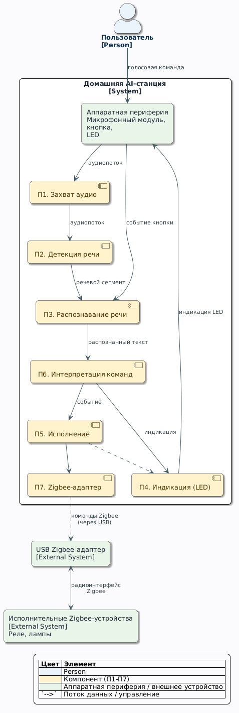

# Техническое задание на систему «Домашняя AI-станция» (SRS)

Версия документа: 0.1

Связанные документы:

[Видение и границы](./vision-ru.md), [Бэклог](./backlog-ru.md), [Карта пользовательских историй](./user-story-map-ru.md).

Содержание

## 1. Общие сведения

### 1.1. Полное и краткое наименование системы

- Полное наименование: автоматизированная система локального распознавания речи и голосового управления устройствами с поддержкой протокола Zigbee «Домашняя AI-станция».
- Краткое наименование: Домашняя AI-станция (далее — Система, АС).

### 1.2. Заказчик и разработчик

- разработчик: <сообщество проекта>;
- модель разработки: OpenSource;

### 1.3. Перечень документов, на основании которых создаётся Система

- ГОСТ 34.602-2020 «Информационная технология. Комплекс стандартов на автоматизированные системы. Техническое задание на создание автоматизированной системы»;
- [docs/vision-ru.md](./vision-ru.md) — видение и границы проекта;
- документация Orange Pi CM4 (Rockchip RK3566);

### 1.4. Термины и сокращения

- ASR (Automatic Speech Recognition) — распознавание речи;
- STT (Speech-to-Text) — перевод речи в текст;
- GigaAM — открытая русская ASR-модель;
- VAD (Voice Activity Detection) — детекция речевой активности;
- Zigbee — открытый протокол беспроводной сети устройств малого радиуса;
- HAT (Hardware Attached on Top) — плата расширения на 40-контактном разъёме;
- Интент — распознанное намерение пользователя (действие + параметры);
- DTB (Device Tree Blob) — скомпилированное описание устройств платформы;
- ФТ — функциональное требование; НФ-требование — нефункциональное требование;
- UC (Use Case) — сценарий использования системы;
- Логическая модель данных — представление сущностей данных и связей между ними без привязки к физической реализации хранения.

## 2. Назначение и цели создания Системы

### 2.1. Назначение Системы

Система предназначена для управления устройствами Zigbee через голосовой интерфейс.

### 2.2. Ожидаемые цели создания

- Ц1. Обеспечить автономное распознавание речи на одноплатном компьютере Orange Pi CM4 (SoC RK3566) под управлением Embedded Linux.
- Ц2. Реализовать управление устройствами Zigbee голосовыми командами из фиксированного словаря.

## 3. Характеристика Системы

### 3.1. Описание Системы

Система — модуль с голосовым интерфейсом для приема команд и управления исполнительными устройствами(реле, лампы, датчики) через интерфейс Zigbee.

### 3.2. Контекст

Контекстная диаграмма: Система и внешние сущности с информационными потоками
между ними.

Исходный код диаграммы: [diag-context.uml](./diagrams/diag-context.uml).

### 3.3. Сценарии использования (Use case)

Сценарии использования Системы.

Общая диаграмма сценариев — код PlantUML: [diag-usecase.uml](./diagrams/diag-usecase.uml).

#### UC-01. Исполнить голосовую команду Zigbee-устройством

| Поле | Содержание |
|---|---|
| Актор | Пользователь (основной); Zigbee-устройство (вторичный) |
| Триггер | пользователь произносит команду из словаря |
| Предусловие | Система запущена, сервисы активны; Zigbee-адаптер работоспособен; |
| Основной поток | 1. П1 захватывает аудиопоток. 2. П2 детектирует речевой сегмент. 3. Система переводит фазу в «распознаю»; П3 выдаёт транскрипт сегмента в реальном времени; выполняется UC-02. 4. П6 нормализует текст и вычисляет процент совпадения с командой словаря. 5. Процент ≥ порогу подтверждения: П6 инициирует событие управления; Система переводит фазу в «команда»; выполняется UC-02. 6. П7 исполняет действие на целевом устройстве. 7. Система фиксирует в журнале событие управления. 8. Постусловие достигнуто |
| Альтернативные потоки | 2a. Речевой сегмент не обнаружен — возврат к шагу 1. 4a. Процент совпадения ниже порога подтверждения — фраза игнорируется, событие управления не порождается. 6a. Устройство недоступно — Система переводит фазу в «ошибка», выполняется UC-02; в журнал фиксируется «ошибка» |
| Постусловие | При успехе: состояние Zigbee-устройства изменено; событие управления зафиксировано в журнале. При 6a: состояние Zigbee-устройства не изменено; ошибка зафиксирована в журнале |

#### UC-02. Проиндицировать статус Системы

| Поле | Содержание |
|---|---|
| Актор | Пользователь (вторичный) |
| Триггер | Смена фазы Системы на индицируемую: «распознаю», «команда», «ошибка». Фаза «слушаю» светодиодами не отображается |
| Предусловие | Система запущена; журнал доступен; задана таблица соответствия фазы и светодиода (см. п. 4.1, П4); все три светодиода работоспособны |
| Основной поток | 1. Система определяет текущую фазу 2. П4 включает светодиод, закреплённый за фазой, в заданном режиме. 3. Система фиксирует фазу в журнале |
| Альтернативные потоки |  |
| Постусловие | Текущая фаза отображена доступными средствами индикации; событие зафиксировано в журнале |

#### UC-03. Диагностика и мониторинг Системы

| Поле | Содержание |
|---|---|
| Актор | Оператор |
| Триггер | подозрение на сбой, плановая проверка |
| Предусловие | доступ по SSH; диагностические скрипты установлены; журнал systemd доступен; у Оператора есть права на чтение журнала |
| Основной поток | 1. Оператор запускает скрипт диагностики аппаратуры: аудио, DTB. 2. Система выдаёт состояние аппаратуры. 3. Оператор просматривает журнал systemd: события работы и событий управления |
| Альтернативные потоки | 3а. Журнал не сохранил запись событий |
| Постусловие | Состояние аппаратуры проверено; инциденты отражены в журнале;  |

#### UC-04. Обновление прошивки (черновик)

| Поле | Содержание |
|---|---|
| Актор | Пользователь |
| Триггер |  |
| Предусловие | Прошивка записана на USB-носитель; USB-носитель физически установлен в порт; USB-носитель не поврежден |
| Основной поток | 1. Пользователь нажимает кнопку 1 на интерфейсе |
| Альтернативные потоки |  |
| Постусловие | Обновление завершено; Статус обновления проиндуцирован светодиодом; Событие обновления записано в журнале; |

## 4. Требования к Системе

Общая диаграмма компонент — код PlantUML: [diag-components.uml](./diagrams/diag-components.uml).

### 4.1. Требования к структуре

Система состоит из подсистем.

- П1. Подсистема записи речи: микрофонный модуль;
- П2. Подсистема детекции и предобработки речи;
- П3. Подсистема распознавания речи;
- П4. Подсистема индикации: LED на микрофонном модуле;
- 4.1 Соответствие фаз и светодиодов:
| Фаза | Светодиод | Режим |
|---|---|---|
| «слушаю» | — | все выключены |
| «распознаю» | LED-1 | постоянный |
| «команда» | LED-2 | 1с |
| «ошибка» | LED-3 | мигание |
- П5. Подсистема исполнения: сервисы systemd, журнал событий;
- П6. Подсистема интерпретации команд: сопоставляет распознанный текст со словарём; порождает событие управления; передаёт событие в П7;
- П7. Подсистема управления Zigbee: взаимодействие с USB-адаптером Zigbee;

### 4.2. Функциональные требования (Functional Requirements, FR)

### 4.2.1 Общие требования:

- FR-1.1. Система должна записывать речь через микрофонный модуль;

### 4.2.2 Требования к записи речи и распознаванию:

- FR-2.1. Подсистема захвата аудио (П1) должна непрерывно захватывать аудиопоток с выбранного входа;
- FR-2.2. Подсистема детекции речи (П2) должна выделять речевые сегменты в аудиопотоке;
- FR-2.3. Подсистема распознавания речи (П3) должна выдавать транскрипт речевых сегментов в реальном времени;
- FR-2.4. Система должна применять модуль программного усиления речи;

### 4.2.3 Требования к голосовому управлению:

- FR-3.1. Система должна содержать словарь команд: каждая команда — шаблон распознаваемой фразы, сопоставленный действию;
- FR-3.2. Подсистема интерпретации команд (П6) должна нормализовывать распознанный текст и вычислять процент совпадения с командами словаря;
- FR-3.3. При проценте совпадения ниже порога подтверждения (80%) подсистема интерпретации команд (П6) должна игнорировать фразу;
- FR-3.4. При проценте совпадения выше порога подтверждения (80%) подсистема интерпретации команд (П6) должна создать событие управления;
- FR-3.5. При появления события управления Zegbee, подсистема интерпретации команд (П6) должна передать событие в подсистему управления Zegbee;
- FR-3.6. При получении события управления, подсистема управления Zigbee (П7) должна исполнить команду на целевом устройстве;
- FR-3.7. Система должна фиксировать каждое событие - команда, действие, сбой - в журнале с меткой времени;
- FR-3.8. Система должна подтверждать исполнение команды LED-индикацией (см. п.4.1);

### 4.2.4 Требования к управлению через кнопки:

- FR-4.1. Система должна активировать обновление прошивки при нажатии кнопки 1;

### 4.3. Нефункциональные требования (Non-Functional Requirements, NFR)

### 4.3.1 Требования к надёжности

- NFR-1.1. Система должна функционировать не менее 24 часов после запуска;
- NFR-1.2. При сбое сервиса подсистема исполнения (П5) должна автоматически перезапускать сервис средствами systemd;
- NFR-1.3. При зависании процесса Система должна перезапускать процесс;
- NFR-1.4. При потере питания Система должна сохранять целостность файловой системы и сохранённых данных;
- NFR-1.5. При отказе Zigbee-адаптера Система должна продолжать выполнять функции захвата аудио и распознавания;
- NFR-1.6. Система должна обеспечивать среднюю наработку на отказ не менее 720 ч непрерывной работы;

### 4.3.2 Требования безопасности

- NFR-2.1. Система должна обрабатывать данные локально;
- NFR-2.2. Система должна ограничивать сетевой доступ;
- NFR-2.3. Система должна исполнять сервисы под выделенной учётной записью (не root), если сервис не требует привилегии;
- NFR-2.4. Система должна ограничивать привилегии сервисов конфигурацией sudoers;
- NFR-2.5. Система должна запретить ложные срабатывания на произвольную речь;
- NFR-2.6. Система должна запретить SSH-доступ: сервис openssh выключён; порт 22 закрыт; аутентификация SSH запрещена;
- NFR-2.8. Система должна запретить все входящие соединения, кроме протокола Zegbee;

### 4.3.3 Требования к интерфейсам

- NFR-3.1. Система должна предоставлять пользователю визуальную индикацию для фаз: «слушаю», «команда», «готово», «ошибка»;
- NFR-3.2. При нажатии пользователем кнопки Система должна выполнять назначенное действие;
- NFR-3.3. Система должна захватывать аудио с ALSA-карты (44,1/48 кГц);
- NFR-3.4. Система должна преобразовывать поток программно в 16 кГц моно для распознавания;

### 4.3.4 Требования к совместимости (аппаратной и программной)

- NFR-4.1. Система должна функционировать на платформе Orange Pi CM4 (SoC RK3566, 4×Cortex-A55) под ядром Linux 6.18;
- NFR-4.2. Система должна управлять исполнительными устройствами через USB Zigbee-адаптер;
- NFR-4.3. Система должна быть совместима с окружением Python 3;

### 4.3.5 Требования к производительности

- NFR-5.1. Подсистема распознавания речи (П3) должна распознавать речевой сегмент с задержкой не более 2-кратной длительности сегмента;
- NFR-5.2. Система должна распознавать тихую речь с дистанции не менее 1 м с погрешностью менее 20%;
- NFR-5.3. Система должна распознавать громкую речь — до 5 м с погрешностью менее 20%;
- NFR-5.4. Система должна выполнять цикл «команда - исполнение» за время не более 10 с после окончания речи;

### 4.3.6 Требования к эксплуатации

- NFR-6.1. Система должна предоставлять средства диагностики для администратора;
- NFR-6.2. Система должна регистрировать рабочие события и сбои в журнале systemd;

### 4.3.7 Требования к документированию

- NFR-7.1. Документация проекта должна быть опубликована в репозитории проекта;
- NFR-7.2. Документация должна включать в состав: "Видение и границы", "SRS", "README", "CONTRIBUTING", "CHANGELOG", "Глоссарий";
- NFR-7.3. Документация должна быть оформлена в нотации Markdown;

### 4.3.8 Требования к конструкции

- NFR-8.1. Физические компоненты системы должны быть размещены в едином корпусе;
- NFR-8.2. Корпус должен вмещать компоненты: одноплатный компьютер Orange Pi CM4, микрофонный модуль ReSpeaker 2-Mic, плату с кнопками, интерфейс питания, шлейфы соединения, систему пассивного охлаждения;
- NFR-8.3. Корпус должен обеспечивать доступ к USB, питанию и кнопкам без разборки;
- NFR-8.4. Конструкция корпуса должна выдерживать падение с высоты 1 метр;

### 4.3.9 Требования к составу ПО и драйверам

- NFR-9.1. Система должна поддерживать архитектуру aarch64;
- NFR-9.2. Система должна поддерживать ядро 6.18.x;
- NFR-9.3. В Системе должны быть установлены пакеты: systemd, NetworkManager, wpa_supplicant, openssh-server, python3; виртуальное окружение KWS (vosk 0.3.45, onnxruntime ≥ 1.23.2, numpy ≥ 2.5, cffi, requests, tqdm, srt, gpiod ≥ 2.5, spidev);
- NFR-9.4. В системе должны быть установлены драйверы: brcmfmac; snd-soc-wm8960 (ReSpeaker 2-Mic HAT); spidev3.0; libgpiod;
- NFR-9.5. В системе должны быть установлены прошивки: brcmfmac43456-sdio.bin|.txt|.clm_blob;

## 5. Порядок контроля и приёмки Системы

### 5.1. Виды испытаний

- Приёмо-сдаточные проверки выполняются по приёмочным тестам;
- Аудио-тракт (запись звука) проверяется замерами;
- Расшифровка речи проверяется на эталонных записях (тихая речь, несколько голосов, команды);

### 5.2. Приёмочные тесты (TC: Test case)

- ТC-01. Сценарий «громкая речь на расстоянии»: речь с 3 м распознаётся;
- ТC-02. Команда «включи свет»  активирует устройство Zigbee, журнал содержит событие;
- ТC-03. Произвольная речь вне словаря команд не активирует устройство Zigbee;
- ТC-04. После перезагрузки устройства происходи перезапуск служебных сервисов;
- TC-05. Корпус первого релиза соответствует требованиям;
- TC-06. Адрес устройства не обнаружен в локальной сети;
- TC-07. Состав ПО - пакеты, драйвера - соответствует требованиям;

## 6. Требования к документированию Системы (перечень документов)

- Документация требований: [docs/vision-ru.md](./vision-ru.md),
  [docs/srs-ru.md](./srs-ru.md);
- аппаратная документация: [docs/hardware-ru.md](./hardware-ru.md),
  [docs/glossary-ru.md](./glossary-ru.md);
- программная документация: спецификации возможностей ([openspec/specs/](../openspec/specs/)),
  скрипты и сервисы (см. README);
- процессные документы: CONTRIBUTING.md, CHANGELOG.md;
