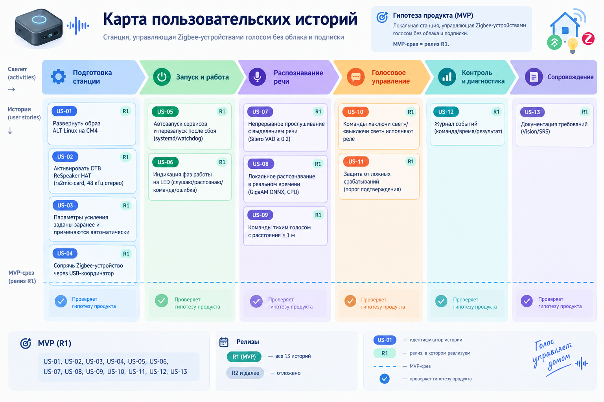

# Карта пользовательских историй (User Story Map)

Версия документа: 0.1
Дата: 2026-09-12
Статус: черновик
Связанные документы: [Видение и границы](./vision-ru.md), [SRS](./srs-ru.md), [Бэклог](./backlog-ru.md)

## 1. Назначение

Карта показывает пользовательские сценарии станции слева направо (скелет)
и истории под ними сверху вниз (по мере детализации). Горизонтальная линия —
MVP-срез: истории над линией проверяют гипотезу продукта.

## 2. Гипотеза продукта (MVP)

Пользователю нужна локальная станция, управляющая Zigbee-устройствами
голосом без облака и подписки. MVP-срез = релиз R1.

## 3. Скелет (activities)

Подготовка станции → Запуск и работа → Распознавание речи →
Голосовое управление → Контроль и диагностика → Сопровождение

## 4. Карта историй

### Подготовка станции
- US-01 Развернуть образ ALT Linux на CM4 — R1
- US-02 Активировать DTB ReSpeaker HAT (rs2mic-card, 48 кГц стерео) — R1
- US-03 Параметры усиления заданы заранее и применяются автоматически — R1
- US-04 Сопрячь Zigbee-устройство через USB-координатор — R1

### Запуск и работа
- US-05 Автозапуск сервисов и перезапуск после сбоя (systemd/watchdog) — R1
- US-06 Индикация фаз работы на LED (слушаю/распознаю/команда/ошибка) — R1

### Распознавание речи
- US-07 Непрерывное прослушивание с выделением речи (Silero VAD ≥ 0.2) — R1
- US-08 Локальное распознавание в реальном времени (GigaAM ONNX, CPU) — R1
- US-09 Команды тихим голосом с расстояния ≥ 1 м — R1

### Голосовое управление
- US-10 Команды «включи свет»/«выключи свет» исполняют реле — R1
- US-11 Защита от ложных срабатываний (порог подтверждения) — R1

### Контроль и диагностика
- US-12 Журнал событий (команда/время/результат) — R1

### Сопровождение
- US-13 Документация требований (Vision/SRS) — R1

## 5. MVP-срез и релизы

- R1 (MVP): US-01, US-02, US-03, US-04, US-05, US-06, US-07,
  US-08, US-09, US-10, US-11, US-12, US-13
- R2 и далее — отложено
