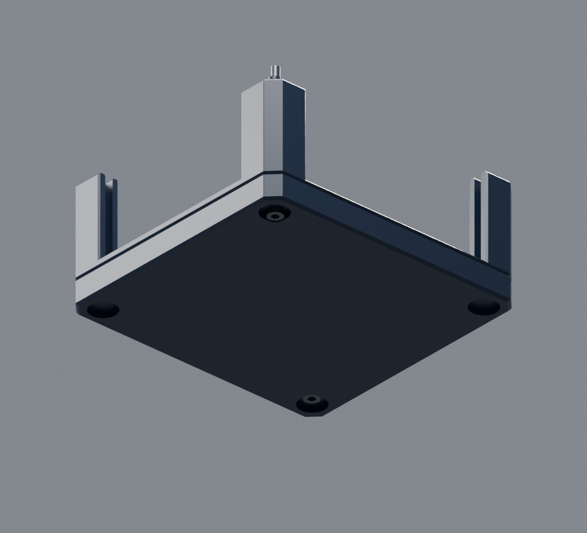
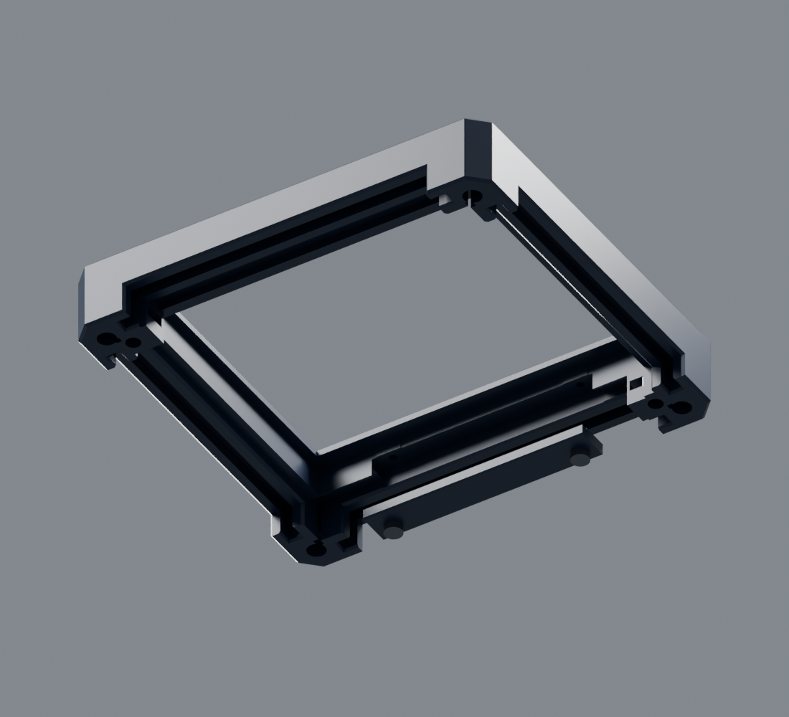

# Импульсар-01 / 06

Акрил **2,85 мм**, пазы **3,00 мм**,
верхняя панель под съёмной планкой, две половины на винтах снизу.
Состав варианта и генерация моделей описаны в [README](README.md).

## Геометрия варианта

| Параметр | rev06 |
| --- | --- |
| Габарит корпуса | 102 × 95 × 60 мм |
| Толщина всех пяти панелей | 2,85 мм |
| Ширина боковых пазов | 3,00 мм: суммарный зазор 0,15 мм |
| Высота обоих пазов верхнего акрила | 3,00 мм: суммарный зазор 0,15 мм |
| Верхний акрил в сборке | Z=55,075…57,925 мм |
| Контактные поверхности верхних пазов | Z=55 / 58 мм |
| Фаски стыка / глубина нижней V-канавки | одинаковые 0,60 мм |
| Высота каждой декоративной линии | 1,32 мм номинально, без сборочного зазора стыка |
| Основные печатные детали | основание, рамка, прижимная планка: 3 детали |

Передний паз верхнего акрила встроен в рамку. Задний образуется рамкой и
прикрученной планкой. Планка упирается в пластиковые площадки: затяжка не должна
прижимать акрил. Отверстий под крепёж в акриле нет.
Окно верхней рамки прямоугольное, без скруглений углов, с фаской 0,6 мм по кромке.
Габарит проёма под фаской — 76,4 × 61,4 мм; контур самого акрила сохранён.
Защёлки и их штифты исключены, исходные установочные штифты половинок сохранены.

В основании внутренние плоские поверхности стенок отодвинуты наружу на **0,5 мм
с каждой стороны**, начиная от поверхности дна Z=2,5 мм. Между противоположными
прямыми участками теперь **86,4 × 79,4 мм** вместо 85,4 × 78,4 мм. Это расстояние
между стенками, а не свободный прямоугольник через угловые стойки. Стойки платы,
усиления винтов и пазы акрила сохранены; толщина внутренней стенки рядом с пазом
теперь 2,15 мм. Фактическую посадку платы проверить после печати.

## Крепёж: что купить

| Количество | Наименование | Назначение |
| ---: | --- | --- |
| 2 | **Винт M3×50, DIN 912 / ISO 4762**, цилиндрическая головка, внутренний шестигранник | Соединение половинок |
| 2 | **Гайка M3, DIN 934**, обычная шестигранная, размер под ключ 5,5 мм, высота 2,4 мм | Боковые карманы верхней рамки |
| 2 | **Саморез ST2,2×6,5, DIN 7981**, полукруглая головка, крестовой шлиц | Планка верхнего акрила |

Длина винтов и саморезов указана **под головкой**. Не заменять гайки высокими
самоконтрящимися и саморезы потайными: посадки рассчитаны на указанные формы.
Для покупки удобно взять по 4 штуки каждого крепежа — с запасом на пробники.
Обычно потребуются шестигранник 2,5 мм и отвёртка PH1; шлиц сверить при покупке.

Это соединение обходится без термовставок и паяльника. Винты M3 работают с
металлическими гайками при каждом открытии корпуса. Саморезы используются только
для менее частого снятия верхнего акрила.

### Посадки и доступ

- Оси винтов M3: **XY=(10; 10) и (92; 85)**, диагонально противоположные углы.
- Проходные отверстия Ø3,4 мм. Головка винта Ø5,5 × 3 мм утоплена на 0,3 мм.
- Все четыре исходных углубления под ножки сохранены **Ø10 × 2 мм**.
  В двух винтовых углах добавлена только локальная выборка **Ø6 мм до глубины
  3,3 мм** по оси винта. Она частично выходит за контур исходного углубления.
  Над головкой добавлена сплошная опорная перемычка толщиной **1,7 мм** вокруг
  проходного отверстия; боковая стенка выборки — не менее **1,4 мм**.
- Гайки входят в боковые карманы изнутри снятой рамки, через небольшие удерживающие
  выступы. Плоские стенки не дают гайке провернуться. Продвинуть гайку до упора и
  совместить её резьбу с осью винта. Удержание выступами проверить на реальной гайке.
- Гайка занимает Z=46,6…49,0; конец затянутого M3×50 находится на Z=53,3,
  до дна глухого отверстия остаётся 1 мм. Резьба винта проходит всю высоту гайки.
- У планки проходные отверстия Ø2,6 мм, в рамке направляющие Ø1,8 мм.
  Толщина планки у крепежа 2,7 мм, номинальное заглубление самореза — 3,8 мм.
  До наружной поверхности крышки от конца самореза остаётся 1 мм.
- Если устанавливать мягкие ножки поверх головок M3, две из них придётся снимать
  для разборки. Ножки не входят в комплект моделей.

## Экспорты и ориентации деталей

| Файл | Количество |
| --- | ---: |
| [print/body_print.stl](print/body_print.stl) | 1 |
| [print/lid_print.stl](print/lid_print.stl) | 1 |
| [print/glazing_bar_print.stl](print/glazing_bar_print.stl) | 1 |

Сохранять ориентации файлов: рамка наружной стороной на стол, планка плоской
стороной на стол. Детали `assembly/` имеют координаты сборки и не предназначены
для прямой отправки на печать.

Модели заданы в миллиметрах. Масштабирование меняет расчётные посадки и зазоры;
для их изменения следует использовать параметры генератора.

**У рамки нужна локальная поддержка под нижней полкой переднего паза.**
В печатной ориентации это полоса X=24…78, Y=78,5…80,2, Z=5 мм.
Под полкой находится наружный бортик рамки, поэтому поддержка этой поверхности
должна опираться на модель.
Сначала отработать снятие поддержки на `fixed_groove_print.stl`; после снятия
поверхности паза должны остаться ровными, без остатков интерфейсного слоя.

Остальные предусмотренные горизонтальные поверхности:
- карманы гаек печатаются мостами шириной до **5,7 мм**;
- исходные углубления под ножки — **10 мм**, локальные выборки под головки — **6 мм**;
- исходное нижнее служебное отверстие — мост до **21 мм**.

Эти участки и посадки представлены отдельными пробниками; технологические
параметры изготовления подбираются отдельно от геометрической модели.

### Многоцветная геометрия

[multicolor/lid_multicolor.3mf](multicolor/lid_multicolor.3mf) содержит рамку и два
золотистых акцента как **один объект с тремя частями** в общей системе координат.
Основной цвет — тёмно-синий; толщина декоративных вставок — 0,40 мм.
Файл хранит геометрию и цвета, без профиля оборудования. Взаимное положение частей
должно сохраняться; поддержка переднего паза нужна так же, как для одноцветной рамки.

## Сначала пробники

1. `coupons/groove_2.95_print.stl`, `groove_3.00_print.stl`, `groove_3.05_print.stl`:
   проверить реальный лист. Номинальный корпус использует **3,00 мм**.
2. `coupons/actual_groove_print.stl`: проверить настоящий участок бокового паза,
   включая заход и наружный профиль.
3. `coupons/fixed_groove_print.stl`: проверить поддержку и посадку верхней панели.
4. `coupons/bar_mount_print.stl` + `bar_end_print.stl` и ST2,2×6,5:
   проверить нарезание резьбы саморезом и посадку планки на упор.
5. `coupons/nut_corner_print.stl`: проверить установку гайки и удерживающие выступы.
6. `coupons/bolt_lower_corner_print.stl` + `bolt_upper_corner_print.stl`:
   полноценный угол с исходным установочным штифтом, гайкой и M3×50.
   После печати верхний фрагмент перевернуть в сборочное положение и состыковать
   по штифту; пробник проверяет реальную длину винта и доступ к головке.
7. `coupons/cm4_trial_print.stl`: примерить окна к разъёмам платы.

Гайки и саморезы проверить до печати рамки. Саморезы затягивать вручную до контакта
планки с упорами. Если посадка акрила окажется тесной, изменить `groove_width_mm` в
`design.json` и пересобрать, вместо силового вдавливания стекла.
`parameters.json` в результатах — отчёт о параметрах, сборщик его перезаписывает.

## Лазер: контуры и гравировка

Все пути резки и гравировки корпуса находятся в каталоге `laser/`.
Пять DXF имеют имена `*_2p85.dxf`, обозначающие толщину листа.
Надпись «Орбита импульса» отсутствует; центральные круги остаются только гравировкой.

| Панель | Габарит, мм | Файл |
| --- | --- | --- |
| Передняя | 80 × 45 | [front_2p85.dxf](laser/front_2p85.dxf) |
| Левая, CM4 | 72 × 42 | [left_2p85.dxf](laser/left_2p85.dxf) |
| Задняя | 80 × 45 | [rear_2p85.dxf](laser/rear_2p85.dxf) |
| Правая | 72 × 42 | [right_2p85.dxf](laser/right_2p85.dxf) |
| Верхняя | 80 × 65 | [top_2p85.dxf](laser/top_2p85.dxf) |

Толщина всех панелей — **2,85 мм**. Размеры — габариты фигурных контуров, а не
размеры прямоугольных заготовок. [Общий SVG](laser/layout.svg) — 1:1, миллиметры,
без компенсации ширины реза. `CUT_OUTER` и `CUT_INNER` — резка;
`ENGRAVE_LINES` и `ENGRAVE_FILL` — **заливная гравировка замкнутых контуров**.
Порядок обработки: гравировка, внутренние вырезы, внешний контур.

Окна CM4 по-прежнему оценены по фотографии; размер и привязку нужно проверить
на установленной плате. Тонкая перемычка между окнами — 1,3 мм.

## Сборка

1. Удалить поддержки и проверить каналы. Установить две гайки в карманы рамки.
2. Держать снятую рамку внутренней стороной вверх. Планку пока не ставить.
3. Подать верхний акрил в рамку **параллельно ей**, сместив кромку к задней стороне
   на 1,8 мм относительно конечного положения. Дополнительный карман даёт место
   для такого захода.
4. Сдвинуть акрил на 1,8 мм к передней стороне, завести кромку в неподвижный паз.
5. Установить заднюю планку и два ST2,2×6,5. Акрил должен удерживаться с небольшим
   зазором; планка при этом касается пластиковых упоров.
6. Установить четыре боковые панели в основание, затем надеть рамку по исходным
   установочным штифтам.
7. Вставить два M3×50 снизу и попеременно подтянуть вручную до смыкания половинок.
   Гайки должны быть совмещены с винтами; усилием не протягивать несоосный крепёж.

Разборка выполняется в обратном порядке. Для снятия рамки достаточно двух M3;
саморезы планки трогать не требуется.

## Проверка и пересборка

Команды автономной пересборки и проверки приведены в [README](README.md).
[Отчёты проверки](validation/README.md) фиксируют сопряжения и движения панелей,
заход гаек, проход крепежа и отвёртки, состояние сеток, соответствие CAD контрольной
геометрии и контрольные суммы комплекта.

Резьбы крепежа представлены номинальными огибающими. Пересечение самореза с
направляющим отверстием и малый натяг гайки на входных выступах ожидаемы и записаны
отдельно. Цифровая проверка не устанавливает усилие затяжки, прочность резьбы материала,
ресурс или фактическую посадку после печати. Полная плата с компонентами внутри
корпуса не моделировалась; тепловые испытания не проводились.

[3D-сборка](assembly/impulsar06.glb) · [Вид снизу крышки](previews/lid_underside.png)
· [Разнесённая сборка](previews/exploded.png)
