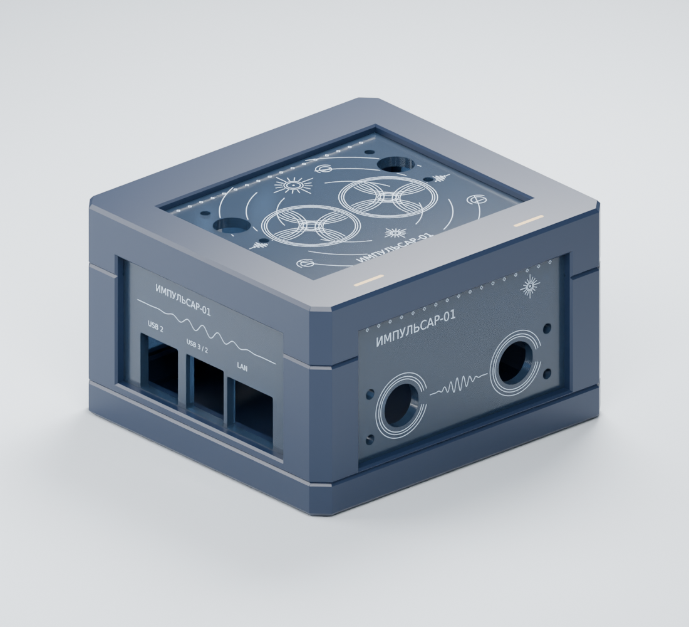

# Импульсар-01 — корпус rev06

Корпус **102 × 95 × 60 мм**: три печатные детали, пять панелей акрила **2,85 мм**,
пазы **3,00 мм**, два винта M3×50 и съёмная планка верхнего акрила.

Самодостаточный вариант корпуса: каталог содержит исходные данные, параметры,
генераторы и контрольные модели этого дизайна. Его можно скопировать отдельно
и собрать без остальных каталогов проекта. Геометрия не привязана к модели
принтера, размеру его рабочего поля или конкретному слайсеру.



## Что открыть

- **Для изготовления:** [инструкция и крепёж](MANUFACTURING.md), [STL для печати](print/),
  [пробники](coupons/), [лазерные DXF/SVG](laser/), [многоцветная крышка 3MF](multicolor/lid_multicolor.3mf).
- **Для редактирования:** [FreeCAD](cad/enclosure.FCStd), [нейтральные STEP](cad/step/),
  [вид нативной CAD-модели](cad/preview.png).
- **Для просмотра:** [3D-сборка GLB](assembly/impulsar06.glb), [разнесённый вид](previews/exploded.png).
- **Конструкция и исходные данные:** [DESIGN.md](DESIGN.md).
- **Результаты проверки:** [STL, FreeCAD и STEP](validation/README.md).

`print/`, `assembly/`, `coupons/`, `laser/`, `multicolor/` и изображения — контрольный комплект
корпуса Импульсар-01 rev06. Его хеши записаны в [reference/assets.sha256.json](reference/assets.sha256.json).
`assembly/` содержит координаты сборки, **не ориентации для печати**.

## Автономная пересборка

Команды выполняются **из этого каталога `impulsar-01-rev06/`**. Все исходные данные
находятся внутри него; доступ к сети при сборке не требуется. Зависимости
устанавливаются заранее:

```bash
python3 -m venv .venv
.venv/bin/python -m pip install -r requirements.txt
.venv/bin/python src/build_mesh.py
```

Результат: локальный `build/mesh/` — сборочные и печатные STL, пробники, многоцветный 3MF,
копии лазерных контуров, параметры, сравнение с исходником и новый отчёт проверок.
Превью и GLB являются сохранёнными иллюстрациями корпуса rev06; сборщик их
не обновляет. После изменения конструкции они могут перестать соответствовать ей.

Параметры задаются в [design.json](design.json). Для экспериментов используйте
копию и `--config путь/к/design.json --output build/мой-вариант`.
`parameters.json` в результатах — отчёт, а не входной файл. Лазерные контуры являются
входными исходниками; изменение толщины не меняет их плоскую геометрию и имена.
После изменения толщины обозначения `2p85` требуют отдельного обновления.

Пути к исходникам и результатам по умолчанию определяются относительно каталога
варианта, независимо от текущего рабочего каталога. Генераторы разрешают вывод
в локальный `build/` или отдельный внешний каталог и защищают исходные данные
и готовый комплект от перезаписи.
Обновление готовых файлов выполняется после проверки результатов и просмотра diff.

## FreeCAD

Требуется FreeCAD **1.1.x** с Python API. Проверено на FreeCAD 1.1.3 / Python 3.14.
Интерпретатор должен совпадать с Python ABI установленного FreeCAD.
Пример для ALT Linux (путь библиотеки в других дистрибутивах отличается):

```bash
PYTHONPATH=/usr/lib64/freecad/lib .venv/bin/python src/build_cad.py
```

Результат: `build/cad/` — `enclosure.FCStd`, STEP отдельных деталей
и сборки, STL из той же CAD-геометрии в сборочных и печатных координатах.
Пересчёт дерева из нескольких сотен операций может занять десятки минут.

Модель содержит нативные эскизы, выдавливания, лофты, цилиндры и булевы операции.
Открытие и редактирование FCStd не требуют установки скриптов проекта.
В таблице **Parameters**, столбец B, доступны толщина акрила, ширина пазов,
радиусы проходных отверстий, отверстий планки и направляющих саморезов.
После изменения выполнить пересчёт документа. Геометрия крепежа — номинальные
огибающие без резьбы. Контуры панелей редактируются в исходных DXF и пересобираются.

CAD восстановлена по исходным STL и измеренным плоским сечениям: это отдельное
параметрическое представление rev06. Круглые элементы CAD аналитические, поэтому
они могут немного отличаться от исходной полигональной аппроксимации.
Оригинальные производственные STL сохранены отдельно от экспортов CAD.
Изменения в GUI FreeCAD **не записываются автоматически в design.json или Python**;
для воспроизводимой правки перенесите значения в конфигурацию/генератор.

## Проверки и физическая приёмка

Сборщик STL проверяет замкнутость и связность сеток, разницу объёмов с исходником,
сопряжения деталей, проход крепежа, дискретные траектории снятия крышки и установки
панелей, удержание верхнего акрила, ожидаемый натяг саморезов и входа гаек.
Отчёты контрольного комплекта находятся в `validation/`, новые создаются в `build/`.

После генерации CAD проверьте повторное открытие FCStd, импорт STEP, сетки,
сравнение с исходником и сопряжения. `--edit-check` дополнительно меняет пять
размеров таблицы и пересчитывает документ; тестовые изменения не сохраняются:

```bash
PYTHONPATH=/usr/lib64/freecad/lib .venv/bin/python src/verify_cad.py --edit-check
```

Цвета и прозрачность готового FCStd настроены в GUI FreeCAD; генератор воспроизводит
геометрию и дерево операций. Превью CAD также сохраняется отдельно от геометрии.

Проверка контрольных сумм, исходных сеток и многоцветного 3MF:

```bash
.venv/bin/python src/verify_assets.py
```

Отчёт создаётся в `build/audit/`.

Статус физической посадки: **не подтверждена**. Окна CM4 оценены по фотографии;
начните с пробника панели и узлов крепления. Полная электроника, провода и охлаждение
не представлены в сборке. Тепловые испытания и падение с 1 м не проводились.
Цифровые проверки подтверждают геометрию, но не заменяют испытаний собранного корпуса.
