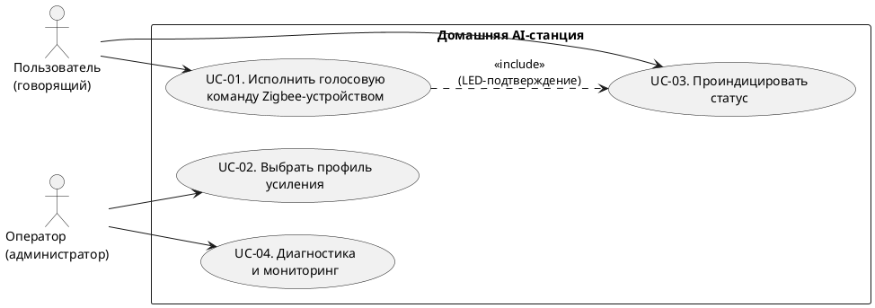
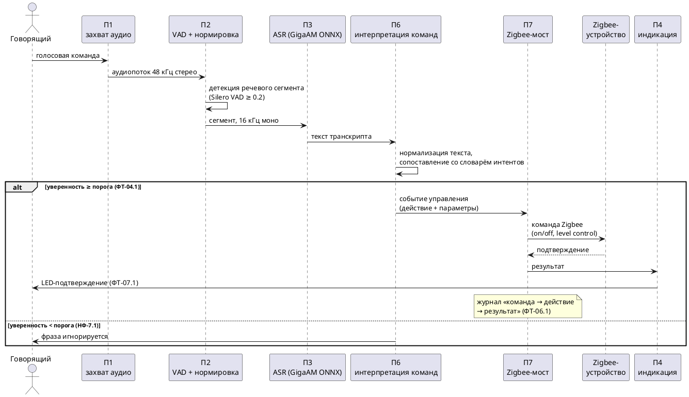
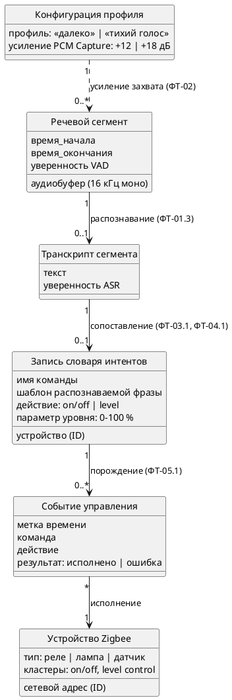

# Техническое задание на систему «Домашняя AI-станция» (SRS)

Версия документа: 0.2
Дата: 2026-09-10
Статус: черновик
Связанные документы:
[Видение и границы](./vision.md), [Дорожная карта](./roadmap.md).

## 1. Общие сведения

### 1.1. Полное и краткое наименование системы

- Полное наименование: автоматизированная система локального распознавания речи и голосового управления устройствами с поддержкой протокола Zigbee «Домашняя AI-станция».
- Краткое наименование: Домашняя AI-станция (далее — Система, АС).

### 1.2. Заказчик и разработчик

- разработчик: <сообщество проекта>;
- модель разработки: OpenSource;

### 1.3. Перечень документов, на основании которых создаётся Система

- ГОСТ 34.602-90 «Информационная технология. Комплекс стандартов на автоматизированные системы. Техническое задание на создание автоматизированной системы»;
- [docs/vision.md](./vision.md) — видение и границы проекта;
- документация Orange Pi CM4 (Rockchip RK3566);

### 1.4. Термины и сокращения

- ASR (Automatic Speech Recognition) — распознавание речи;
- STT (Speech-to-Text) — перевод речи в текст;
- GigaAM — открытая русская ASR-модель;
- VAD (Voice Activity Detection) — детекция речевой активности;
- Zigbee — открытый протокол беспроводной сети устройств малого радиуса;
- HAT (Hardware Attached on Top) — плата расширения на 40-контактном разъёме;
- интент — распознанное намерение пользователя (действие + параметры);
- DTB (Device Tree Blob) — скомпилированное описание устройств платформы;
- ФТ — функциональное требование; НФ-требование — нефункциональное требование;
- UC (Use Case) — сценарий использования системы;
- логическая модель данных — представление сущностей данных и связей между ними без привязки к физической реализации хранения.

## 2. Назначение и цели создания Системы

### 2.1. Назначение Системы

Система предназначена для локального (без обращения к внешним облачным сервисам) распознавания русской речи, голосового управления исполнительными устройствами Zigbee.

### 2.2. Ожидаемые цели создания

- Ц1. Обеспечить автономное распознавание речи на одноплатном компьютере Orange Pi CM4 (SoC RK3566) под управлением Embedded Linux.
- Ц2. Реализовать управление устройствами Zigbee голосовыми командами из фиксированного словаря.

Критерии достижения целей — раздел 6 и [docs/vision.md](./vision.md)
(У1–У3).

## 3. Характеристика объекта автоматизации

### 3.1. Описание объекта автоматизации

Объект автоматизации — домашняя среда пользователя: короткие голосовые команды  и исполнительные устройства Zigbee (реле, лампы, датчики).

### 3.2. Контекстная диаграмма

Контекстная диаграмма: Система и внешние сущности с информационными потоками
между ними. Диаграмма — код PlantUML.

### 3.3. Use case модель

Сценарии использования Системы. Сценарии записи сессий и экспорта на внешние
носители в текущий состав требований не входят.

Общая диаграмма сценариев:

#### UC-01. Исполнить голосовую команду Zigbee-устройством

| Поле | Содержание |
|---|---|
| Актор | Говорящий (пользователь) |
| Веха | M2 |
| Триггер | пользователь произносит команду из словаря интентов |
| Предусловие | Система запущена, сервисы активны (П5); Zigbee-мост (П7) и координатор работоспособны; целевое устройство сопряжено; профиль усиления применён (UC-02) |
| Основной поток | 1. П1 захватывает аудиопоток (ФТ-01.1). 2. П2 детектирует речевой сегмент (ФТ-01.2). 3. П3 выдаёт транскрипт сегмента в реальном времени (ФТ-01.3). 4. П6 нормализует текст и вычисляет уверенность совпадения с интентом (ФТ-04.1). 5. Уверенность ≥ порога подтверждения: П6 порождает событие управления (ФТ-03.1). 6. П7 исполняет действие на целевом устройстве (ФТ-05.1). 7. Система фиксирует в журнале событие «команда → действие → результат» (ФТ-06.1). 8. Система подтверждает исполнение LED-индикацией (ФТ-07.1) |
| Альтернативные потоки | 2a. Речевой сегмент не обнаружен — возврат к шагу 1. 4a. Уверенность ниже порога подтверждения — фраза игнорируется, событие управления не порождается (ФТ-04.2, НФ-7.1). 6a. Устройство недоступно — в журнал фиксируется результат «ошибка», индикация фазы «ошибка» (НФ-8.1) |
| Постусловие | состояние Zigbee-устройства изменено; событие управления зафиксировано в журнале |
| Требования | ФТ-01, ФТ-03–07, НФ-7, НФ-14, НФ-16, НФ-17.2 |
| Бюджет времени | полный цикл ≤ 4 с (НФ-16.1) |

Основной поток UC-01 (диаграмма последовательности):

#### UC-02. Выбрать профиль усиления

| Поле | Содержание |
|---|---|
| Актор | Оператор (администратор) |
| Триггер | изменение акустической обстановки или первичная настройка Системы |
| Предусловие | доступ к Системе по SSH; доступен скрипт настройки |
| Основной поток | 1. Оператор выбирает профиль: «далеко» (+12 дБ) или «тихий голос» (+18 дБ) (ФТ-02.1). 2. Оператор запускает скрипт настройки (ФТ-02.2). 3. Скрипт применяет профиль в тракте захвата (PCM Capture). 4. Скрипт сообщает об успешном применении |
| Альтернативные потоки | 3a. Ошибка применения — скрипт сообщает об ошибке, сохраняется предыдущий профиль |
| Постусловие | захват аудио работает с выбранным усилением (НФ-15.1) |
| Требования | ФТ-02, НФ-11, НФ-15 |

#### UC-03. Проиндицировать статус Системы

| Поле | Содержание |
|---|---|
| Актор | Пользователь (говорящий) — наблюдатель |
| Триггер | переход Системы между фазами: «слушаю», «запись», «инференс», «готово», «ошибка» |
| Предусловие | средства индикации работоспособны (APA102 LED, экран, журнал) |
| Основной поток | 1. При смене фазы П4 обновляет LED-индикацию (НФ-8.1). 2. Система фиксирует фазу в журнале |
| Альтернативные потоки | 1a. LED/экран недоступны — фаза фиксируется только в журнале |
| Постусловие | текущая фаза однозначно наблюдаема пользователем (НФ-8.1) |
| Требования | НФ-8, ФТ-07 |

#### UC-04. Диагностика и мониторинг Системы

| Поле | Содержание |
|---|---|
| Актор | Оператор (администратор) |
| Триггер | подозрение на сбой, плановая проверка, развёртывание Системы |
| Предусловие | доступ по SSH; диагностические скрипты установлены |
| Основной поток | 1. Оператор запускает скрипт диагностики аппаратуры: аудио, DTB, DSI (НФ-18.1). 2. Система выдаёт состояние аппаратуры. 3. Оператор просматривает журнал systemd: события работы и событий управления (НФ-18.2, ФТ-06.1) |
| Альтернативные потоки | 1a. Обнаружен сбой — сервис автоматически перезапускается (НФ-1.2, НФ-1.3), оператор проверяет журнал перезапусков |
| Постусловие | состояние аппаратуры проверено; инциденты отражены в журнале |
| Требования | НФ-1, НФ-18, ФТ-06 |

## 4. Требования к Системе

### 4.1. Требования к структуре и функционированию

Система состоит из подсистем. Состав: П1–П6 действуют в прототипе, П7–П8 — требования на плановые вехи дорожной карты.

- П1. Подсистема захвата аудио: микрофонный HAT ReSpeaker 2-Mic (ALSA-карта `rs2mic-card`, частота 48 кГц стерео); профили усиления «далеко» (PCM Capture +12 дБ) и «тихий голос» (PCM Capture +18 дБ).
- П2. Подсистема детекции и предобработки речи: Silero VAD (порог по умолчанию 0.2, переопределяется флагом `--vad`); программная нормировка усиления до пика ≈0.9 перед инференсом.
- П3. Подсистема распознавания речи: GigaAM (ONNX, реалтайм); допустимая альтернатива — whisper.cpp для сравнительных замеров; распознавание только на устройстве.
- П4. Подсистема индикации: APA102 LED на HAT.
- П5. Подсистема исполнения: запуск сервисов systemd, журнал событий, самовосстановление.
- П6. Подсистема интерпретации команд: сопоставляет распознанный текст с интентами фиксированного словаря; порождает событие управления (действие + параметры устройства); передаёт событие в П7.
- П7. Подсистема Zigbee-моста (веха M2): взаимодействие с USB-координатором Zigbee; приём события управления от П6 и исполнение стандартных кластеров Zigbee (on/off, level control). Конкретный программный стек моста не выбран; требования к интерфейсу зафиксированы в ФТ-05.1 и НФ-12.1 независимо от стека (критерии выбора — [docs/roadmap.md](./roadmap.md), M2).
- П8. Подсистема интеллектуального разбора намерений (веха M3, опция): разбор свободных формулировок команд сверх фиксированного словаря; при недоступности деградирует к фиксированному словарю (П6).

### 4.2. Требования к надёжности

- НФ-1.1. Система должна функционировать в круглосуточном режиме работы.
- НФ-1.2. При сбое сервиса подсистема исполнения (П5) должна автоматически перезапускать сервис средствами systemd (`Restart=`).
- НФ-1.3. При зависании процесса Система должна перезапускать процесс watchdog-таймером.
- НФ-2.1. При потере питания Система должна сохранять целостность файловой системы и сохранённых данных; потеря обрабатываемого речевого сегмента допустима.
- НФ-3.1. При отказе Zigbee-координатора Система должна продолжать выполнять функции захвата аудио и распознавания (П1–П3 не зависят от П7).
- НФ-4.1. Система должна обеспечивать среднюю наработку на отказ не менее 720 ч непрерывной работы — подтверждение журналом работы.

### 4.3. Требования безопасности

- НФ-5.1. Система должна обрабатывать аудиоданные только локально: сетевые обращения распознавания к внешним сервисам должны быть запрещены.
- НФ-5.2. Система должна ограничивать сетевой доступ сервисов локальными интерфейсами Zigbee-моста и администрирования.
- НФ-6.1. Система должна исполнять сервисы под выделенной учётной записью (не root).
- НФ-6.2. Система должна ограничивать привилегии сервисов конфигурацией sudoers.
- НФ-7.1. При совпадении распознанного текста с интентом ниже порога подтверждения Система не должна порождать команду Zigbee — защита от ложных срабатываний на произвольную речь.

### 4.4. Требования к эргономике и технической эстетике

- НФ-8.1. Система должна предоставлять пользователю однозначную индикацию фаз: «слушаю», «запись», «инференс», «готово», «ошибка» — через LED, экран и журнал.
- НФ-9.1. При нажатии пользователем кнопки Система должна выполнять назначенное действие (звуковой статус — в будущих вехах).

### 4.5. Требования к совместимости (аппаратной и программной)

- НФ-10.1. Система должна функционировать на платформе Orange Pi CM4 (SoC RK3566, 4×Cortex-A55) под ядром Linux 6.18.
- НФ-11.1. Система должна захватывать аудио с ALSA-карты `rs2mic-card` (44,1/48 кГц) и преобразовывать поток программно в 16 кГц моно для распознавания.
- НФ-12.1. Система должна управлять исполнительными устройствами через USB Zigbee-координатор, поддерживаемый выбранным стеком моста, стандартными кластерами Zigbee on/off и level control.
- НФ-13.1. Система должна исполнять сервисы распознавания в окружении Python 3 с ONNX Runtime (CPU); состав зависимостей фиксируется документацией.

### 4.6. Требования к производительности и пропускной способности

- НФ-14.1. Подсистема распознавания речи (П3) должна выдавать текст речевого сегмента с задержкой не более 1,5-кратной длительности сегмента (целевой показатель; измерение — приёмочными тестами).
- НФ-15.1. Система должна устойчиво распознавать тихую речь с дистанции не менее 1 м и громкую речь — до 5 м при профилях усиления П1.
- НФ-16.1. Система должна выполнять полный цикл «голосовая команда → действие Zigbee» за время не более 4 с в типовых условиях (целевой показатель вехи M2).
- НФ-17.1. Система должна выполнять распознавание речи на CPU платформы (без GPU/NPU).
- НФ-17.2. Система должна обеспечивать одновременную работу подсистемы распознавания (П3) и подсистемы Zigbee-моста (П7) без деградации.

### 4.7. Требования к эксплуатации и техническому обслуживанию

- НФ-18.1. Система должна предоставлять средства диагностики аппаратуры (аудио, DTB, DSI) — комплектом скриптов.
- НФ-18.2. Система должна регистрировать рабочие события и сбои в журнале systemd.

### 4.8. Требования к данным

Система обрабатывает следующие сущности данных. Речевые сегменты — переходные данные (после распознавания не сохраняются, НФ-5.1); события управления хранятся в журнале systemd (НФ-18.2); словарь интентов и конфигурация профилей — файлы настроек, версионируемые в репозитории.

### 4.9. Функциональные требования

Захват аудио и распознавание:

- ФТ-01.1. Подсистема захвата аудио (П1) должна непрерывно захватывать аудиопоток с выбранного входа.
- ФТ-01.2. Подсистема детекции речи (П2) должна детектировать речевые сегменты в аудиопотоке детектором Silero VAD.
- ФТ-01.3. Подсистема распознавания речи (П3) должна выдавать транскрипт речевых сегментов моделью GigaAM в реальном времени.
- ФТ-02.1. Система должна предоставлять два профиля усиления: «далеко» (+12 дБ) и «тихий голос» (+18 дБ).
- ФТ-02.2. Скрипт настройки должен применять выбранный профиль к тракту захвата (PCM Capture).

Подсистема голосового управления:

- ФТ-03.1. Система должна содержать словарь интентов: каждая команда — шаблон распознаваемой фразы, сопоставленный действию Zigbee (например, «включи свет» → on/off кластер, «яркость пятьдесят» → level control 50 %).
- ФТ-04.1. Подсистема интерпретации команд (П6) должна нормализовывать распознанный текст и вычислять уверенность совпадения с интентом.
- ФТ-04.2. При уверенности совпадения ниже порога подтверждения подсистема интерпретации команд (П6) должна игнорировать фразу (см. НФ-7.1).
- ФТ-05.1. Подсистема Zigbee-моста (П7) должна исполнять событие управления на целевом устройстве.
- ФТ-06.1. Система должна фиксировать каждое событие «команда → действие → результат» в журнале с меткой времени.
- ФТ-07.1. После исполнения команды Система должна подтверждать исполнение индикацией (LED).

### 4.10. Требования к документированию

Состав документации Системы: 
- видение и границы;
- SRS;
- дорожная карта;
- README;
- CONTRIBUTING;
- CHANGELOG;
- Глоссарий;

## 5. Состав и содержание работ по созданию Системы

Работы группируются по вехам дорожной карты ([docs/roadmap.md](./roadmap.md)); 
Соответствие:

- M0 Процессы и документация требований — разделы 1, 8 настоящего ТЗ, состав документации (4.10);
- M1 Аудиотракт и ASR-реалтайм — ФТ-01.1–01.3, ФТ-02.1–02.2; НФ-8.1, НФ-10.1–11.1, НФ-13.1–15.1, НФ-17.1, НФ-18;
- M2 Zigbee и голосовые команды — ФТ-03.1, ФТ-04.1–04.2, ФТ-05.1, ФТ-06.1, ФТ-07.1; НФ-1, НФ-3.1, НФ-5–7, НФ-12.1, НФ-16.1, НФ-17.2;
- M3 (опция) локальная LLM — П8; требования к подсистеме добавляются в настоящее ТЗ при решении о включении опции.

Сроки: M0–M1 выполнены (см. архив изменений OpenSpec и CHANGELOG),
M2 — текущая веха, M3 — плановая.

## 6. Порядок контроля и приёмки Системы

### 6.1. Виды испытаний и гейты

- Приёмо-сдаточные проверки выполняются на стенде по тест-кейсам;
- аудио-тракт проверяется гейтами G1–G3 процедуры замеров (`orange/docs/respeaker2mic.md`, сценарий «совещание до 5 м»);
- ASR проверяется на эталонных записях (тихая речь, совещание, команды).

### 6.2. Приёмочные тест-кейсы

- ТК-01 (ФТ-01.3, НФ-15.1; веха M1). Сценарий «громкая речь издалека»: речь с 5 м распознаётся; гейты G1–G3 пройдены.
- ТК-02 (ФТ-03.1, ФТ-05.1, ФТ-06.1; веха M2). Команда «включи свет» из словаря: устройство Zigbee переключено, журнал содержит событие «команда → on → исполнено»,
  цикл ≤ 4 с (НФ-16.1).
- ТК-03 (НФ-7.1, ФТ-04.2; веха M2). Произвольная речь вне словаря не порождает команд Zigbee.
- ТК-04 (НФ-1.2, НФ-1.3; веха M1). Перезапуск сервиса после искусственного сбоя без вмешательства оператора.

### 6.3. Условия приёмки

Система принимается, если все обязательные тест-кейсы вехи пройдены, результаты внесены в журнал испытаний, изменения отражены в CHANGELOG.

## 7. Требования к документированию Системы (перечень документов)

- Документация требований: [docs/vision.md](./vision.md),
  [docs/srs.md](./srs.md), [docs/roadmap.md](./roadmap.md);
- аппаратная документация: ;
- программная документация: ;
- процессные документы: CONTRIBUTING.md, CHANGELOG.md;

## 8. Журнал изменений документа

- 0.1 (2026-09-10) — первая редакция: структура по ГОСТ 34.602-90, подсистемы, ФТ, НФ, тест-кейсы.
- 0.2 (2026-09-10) — контекстная диаграмма (3.2), use case модель (3.3), требования к данным (4.8); ФТ и НФ переформулированы по синтаксису «субъект + должен + действие + объект» с атомарными подномерами; ФТ перенесены в 4.9, документирование — в 4.10; состав работ (5) и тест-кейсы (6.2) приведены к вехам M0–M3.
